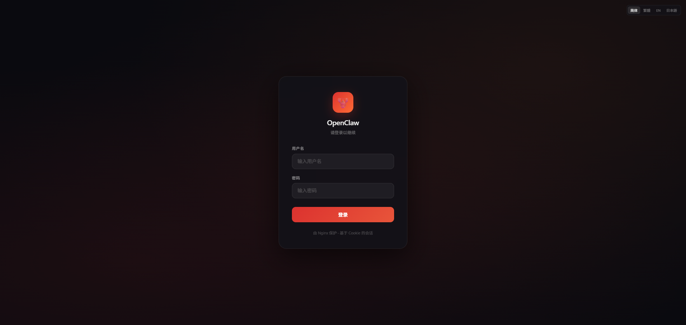
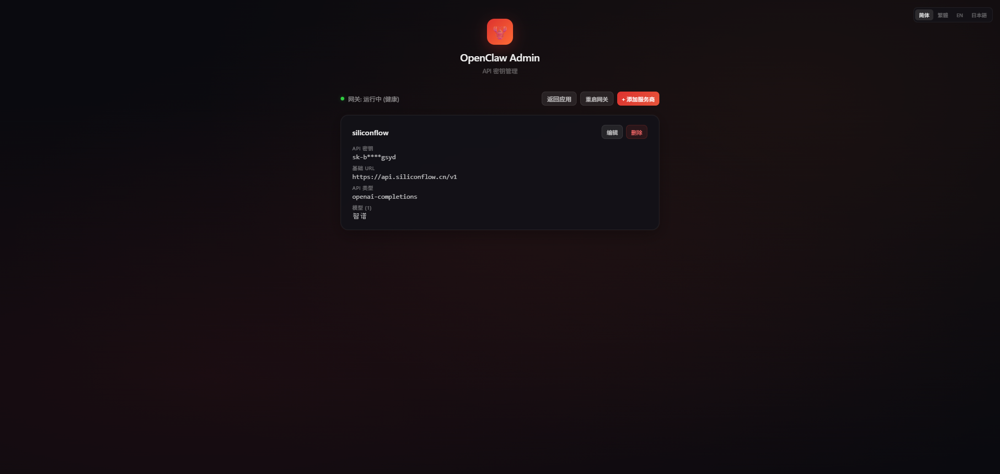
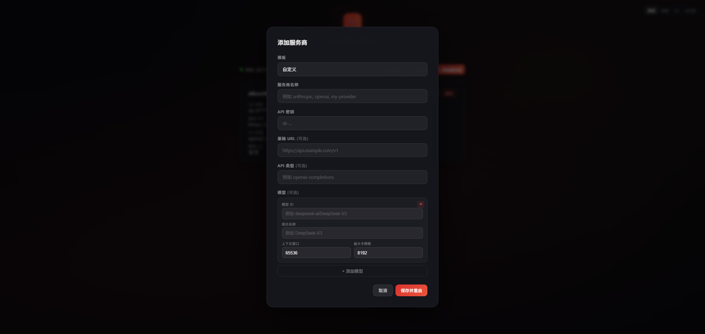

# openclaw-docker

[English](../README.md) | [简体中文](README.zh-CN.md) | [繁體中文](README.zh-TW.md)

Docker Compose を使用した [OpenClaw](https://openclaw.ai/) のデプロイ。Nginx リバースプロキシ、Web 管理パネル、Cookie ベースのセッション認証を統合。

 

## スクリーンショット

| ログイン | 管理パネル - プロバイダー一覧 | 管理パネル - プロバイダー追加 |
|:--------:|:---------------------------:|:---------------------------:|
|  |  |  |

## 特徴

- **ワンコマンドデプロイ** — `setup.sh` がすべてを自動設定
- **カスタムログインページ** — ブラウザの醜いポップアップを排除
- **Web 管理パネル** — ブラウザで API キーを管理（`/admin`）、ファイル編集不要
- **メッセージチャネル** — Feishu、DingTalk、WeChat、QQ、Telegram、Discord、Slack に対応（`/channels`）
- **Feishu SDK ロングコネクション** — WebSocket ベース、イントラネットでもパブリック IP 不要
- **Cookie セッション** — 7日間自動有効期限、HttpOnly + SameSite 保護
- **Gateway Token 自動注入** — ログインするだけで即利用可能
- **多言語 UI** — 簡体字中国語、繁体字中国語、英語、日本語
- **設定の自動生成** — `openclaw.json` は初回起動時に自動作成

## アーキテクチャ

```
ブラウザ → Nginx（ログイン + セッション管理）→ OpenClaw Gateway（内部）
       → /admin                             → Admin API（キー管理）
       → /channels                          → Channels API（メッセージチャネル）

Feishu ←WSClient ロングコネクション→ Channels サービス → AI プロバイダー API
```

**起動順序：** Admin + Channels → Gateway → Nginx（各サービスは前のサービスが正常になるまで待機）

## ダウンロード

| ソース | URL |
|--------|-----|
| GitHub | `git clone https://github.com/wulingshani/openclaw-docker.git` |
| Gitee | `git clone https://gitee.com/luoyile_1/openclaw-docker.git` |

## クイックスタート

```bash
cd openclaw-docker
chmod +x setup.sh
./setup.sh
```

**http://127.0.0.1:18789/** を開く — デフォルトアカウント：`admin` / `openclaw2026`

カスタム認証情報：

```bash
./setup.sh <ユーザー名> <パスワード> <ポート>
./setup.sh admin MyPass123 8080
```

## API キー管理

ログイン後、**`/admin`** にアクセスして Web インターフェースで API キーを管理：

- プロバイダーの追加 / 編集 / 削除（Anthropic、OpenAI、Google、SiliconFlow、カスタム）
- ビジュアルモデル設定 — JSON 編集不要
- 変更後 Gateway が自動再起動
- リアルタイム Gateway ステータス表示

## メッセージチャネル

ログイン後、**`/channels`** にアクセスしてメッセージプラットフォームに接続：

- **対応プラットフォーム：** Feishu、DingTalk、WeChat、WeCom、QQ、Telegram、Discord、Slack
- **Feishu SDK ロングコネクション** — WebSocket ベース、イントラネットでもパブリックコールバック URL 不要
- チャネルごとにシステムプロンプトを設定 — AI パーソナリティをカスタマイズ
- マルチターン会話 — ユーザーごとにコンテキストを維持（20メッセージ、30分タイムアウト）
- `/admin` の AI プロバイダー設定を自動読み取り — キーの重複設定不要
- チャネルごとに個別に有効化 / 無効化

## 設定

### ログインパスワードの変更

```bash
# 新しいパスワードハッシュを生成
docker run --rm httpd:alpine htpasswd -nbB 新ユーザー 新パスワード > nginx/.htpasswd

# .env を編集（NGINX_AUTH_USER と NGINX_AUTH_PASS を変更）

# Nginx を再起動
docker compose restart nginx
```

### ログアウト

`/auth/logout` にアクセスしてセッションをクリア。

## よく使うコマンド

```bash
docker compose logs -f                  # ログを表示
docker compose restart                  # すべて再起動
docker compose down                     # すべて停止
docker compose pull && docker compose up -d  # イメージを更新

# CLI ツール（オンデマンド）
docker compose --profile cli run --rm openclaw-cli dashboard --no-open
docker compose --profile cli run --rm openclaw-cli devices list
```

## プロジェクト構成

```
├── Dockerfile                 # ログイン・管理・チャネルページ内蔵の Nginx イメージ
├── docker-compose.yml         # サービスオーケストレーション（5サービス）
├── setup.sh                   # ワンクリックデプロイスクリプト
├── .env.example               # 環境変数テンプレート
├── admin/
│   └── server.js              # 管理 API サーバー（Node.js、依存関係なし）
├── channels/
│   ├── server.js              # チャネル API + Feishu SDK ブリッジ
│   └── package.json           # 依存関係（Feishu SDK）
├── nginx/
│   ├── default.conf.template  # Nginx 設定テンプレート（envsubst 処理）
│   ├── login.html             # カスタムログインページ
│   ├── admin.html             # API キー管理ページ
│   └── channels.html          # メッセージチャネル管理ページ
└── data/
    ├── config/                # Gateway + チャネル設定（永続化）
    └── workspace/             # ワークスペース（永続化）
```

## セキュリティ

| レイヤー | メカニズム |
|----------|-----------|
| ログイン | Nginx Basic Auth（bcrypt 暗号化） |
| セッション | HttpOnly Cookie、SameSite=Strict、7日間有効 |
| 管理 | セッション保護、メインアプリと同じ Cookie 認証 |
| ゲートウェイ | Token ベースの WebSocket 認証（自動注入） |
| ネットワーク | Gateway と Admin は直接公開せず、Nginx ポートのみ外部公開 |

公開デプロイには Cloudflare Tunnel、Caddy、または Traefik で HTTPS を追加することを推奨。

## 著者

**wulingshan** — [GitHub](https://github.com/wulingshani) | [Gitee](https://gitee.com/luoyile_1)

## ライセンス

MIT
